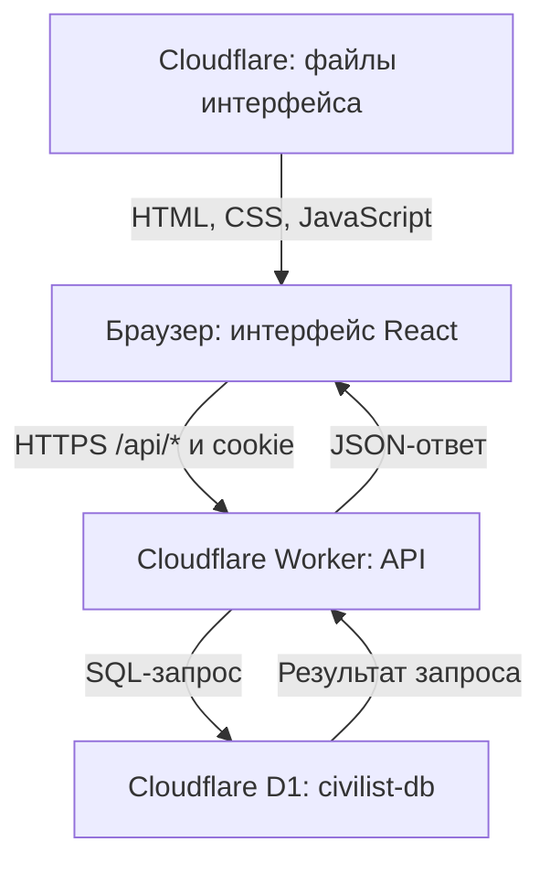

# Как устроен Civilist

Описание действующей версии на 3 октября 2026 года. Основание: исходный код в Pandasayok/civilist, результаты команд на Mac Дмитрия и проверка опубликованного API. Это снимок состояния, а не автоматически обновляемая диагностика.

Приложение: https://civilist.cybenkodmitrij92.workers.dev/
Вход: https://civilist.cybenkodmitrij92.workers.dev/login
Код и история: https://github.com/Pandasayok/civilist
Карта сделанного и предстоящего: [ROADMAP.md](ROADMAP.md).

**У нас есть интерфейс, серверное API и настоящая облачная SQL-база.** Сайт опубликован в Cloudflare. Mac нужен для разработки и публикации; после публикации его можно выключить. GitHub хранит исходники и проверяет изменения, но не обслуживает запросы посетителей.

При проверке 3 октября в 21:51 по Москве запрос GET /api/bootstrap без входа вернул HTTP 401 и сообщение «Войди, чтобы открыть приложение». Это ожидаемая защита API. По порядку проверок в коде такой ответ также подтверждает, что две настройки авторизации загружены и проходят проверку формата. Он не подтверждает успешный вход, содержимое D1 или настройку отдельного редакционного токена. Первый вход и сохранение прогресса в опубликованной версии ещё нужно проверить пользователю.

**Сопоставление с привычным проектом на Docker.**

| Привычная часть | Что используется здесь | Где работает |
|---|---|---|
| Веб-интерфейс, например React | React, TypeScript, стили и компоненты | Код интерфейса исполняется в браузере |
| Nginx или другой сервер статических файлов | Cloudflare Workers Static Assets | Cloudflare отдаёт собранные HTML, CSS, JS и изображения |
| Контейнер с backend/API | Cloudflare Worker с обработчиками запросов | Управляемая среда Cloudflare |
| Контейнер PostgreSQL | Cloudflare D1 с SQL-семантикой SQLite | Управляемая база Cloudflare |
| Docker Compose и конфигурация окружения | wrangler.json, привязки ресурсов и Cloudflare secrets | Часть конфигурации в Git, секреты в Cloudflare |
| Команды сборки | Node.js, npm, Vite и Wrangler | На Mac; проверки также выполняются в GitHub Actions |
| Просмотр данных | SQL в панели D1 или через Wrangler | Облачная либо отдельная локальная база |
| Логи backend | Wrangler tail или Live logs Worker | Запросы и ошибки опубликованного API |

Cloudflare запускает Workers в изолированных контекстах V8 и управляет инфраструктурой. Нам не нужно создавать для приложения собственный Docker-контейнер, администрировать Linux или держать Node.js-процесс на Mac. Серверы существуют, но их обслуживание берёт на себя провайдер.

**Путь запроса посетителя.**



Интерфейс и API используют один адрес сайта. Запросы /api/* обрабатывает Worker. Остальные пути обслуживаются как статические файлы с поддержкой одностраничного приложения. GitHub и Mac не участвуют в обычном ответе на нажатие кнопки.

React отвечает за экраны, кнопки, показ карточек и результатов. Backend проверяет вход и права, валидирует данные, оценивает задания с заданными ответами и записывает результаты. D1 хранит данные между запросами, обновлениями страницы и публикациями новых версий.

**Пример: Софья отвечает на тест.**

1. После входа браузер вызывает GET /api/bootstrap и получает материалы, профиль и рассчитанный прогресс.
2. При ответе отправляет POST /api/activity: ID события, тип задания, ID задания и ответ.
3. Worker проверяет cookie, определяет пользователя и загружает опубликованное задание из D1.
4. Сервер проверяет ответ по правилам задания, определяет результат и XP.
5. Создаёт строку в events. Для карточки также обновляет reviews.
6. Читает актуальное состояние пользователя из базы и возвращает JSON.
7. React показывает полученный результат.

Источником постоянного прогресса является D1. Состояние экрана хранится в памяти React, но результаты не зависят от сохранности этой памяти. После обновления страницы приложение заново получает данные с сервера. На другом устройстве тот же код Софьи означает тот же user_id и тот же прогресс. Обновления приходят после загрузки или следующего запроса; автоматической доставки изменений через WebSocket сейчас нет.

**База называется civilist-db.** На Mac настроена привязка DB к созданной облачной базе. Backend обращается к ней через env.DB. database_id — идентификатор ресурса, а не пароль. Знать его недостаточно для доступа к данным.

D1 использует SQL-семантику SQLite. Это другая СУБД по отношению к PostgreSQL: SQL-навыки применимы, но типы, функции и некоторые возможности отличаются. Обычного PostgreSQL-подключения с host, портом 5432, логином и паролем у этой базы нет. Приложение использует привязку Worker, а администратор — панель или авторизованный Cloudflare API/CLI.

В схеме приложения шесть таблиц. Первая SQL-миграция успешно применена к облачной D1. Живые строки этой базы в ходе этой проверки не читались: ниже описана структура по исходникам.

| Таблица | Столбцы | Для чего нужна |
|---|---|---|
| content | id, kind, body, status, updated_at | Материалы всех видов: направления, уроки, карточки, вопросы, игровые дела, практика, шаблоны |
| metadata | key, value | Технические отметки, включая завершение начального наполнения seed-v1 |
| profiles | user_id, name, goal | Имя пользователя и дневная цель по XP |
| events | id, user_id, kind, target_id, answer, correct, xp, day, created_at | История учебных действий и начислений |
| reviews | user_id, card_id, level, due_at, rating | План повторения карточек |
| bookmarks | user_id, item_id | Сохранённая судебная практика |

content.body и events.answer хранят JSON как текст. correct может быть 1, 0 или NULL: последнее используется, когда результат не оценивается автоматически, например для краткого письменного ответа. В profiles нет поля общего XP: сервер рассчитывает его суммой events.xp. Из событий также рассчитываются статистика, завершённые уроки, серия дней и вопросы для повторения. Учебный день определяется в часовом поясе Europe/Moscow.

Первичный ключ profiles — user_id, а events.id — UUID события. В reviews уникальна пара user_id + card_id, в bookmarks — user_id + item_id. Есть индексы для выборок материалов и событий пользователя. Связи по ID проверяются приложением; SQL FOREIGN KEY в текущей схеме не объявлены. Также можно увидеть служебные таблицы, например d1_migrations, которые ведут учёт миграций.

**Откуда берутся первоначальные материалы.** Они находятся в content/seed.json: 9 направлений, 12 уроков, 24 карточки, 27 вопросов, 2 игровых дела, 4 материала практики и 6 шаблонов — всего 84 записи.

Создание таблиц и наполнение — разные операции. При первом успешном запросе материалов после входа приложение проверяет metadata, записывает начальные материалы и ставит отметку seed-v1. При загрузке состояния создаётся профиль пользователя, если его ещё нет. Поэтому пустые таблицы до первого входа могут быть нормальным состоянием.

Далее материалы и правки администратора живут в D1. Простое изменение seed.json и повторная публикация не перезаписывают уже наполненную базу. Для изменения текущих материалов предусмотрен административный редактор; массовые изменения данных требуют отдельной операции.

**Вход и права.** Открытой регистрации сейчас нет. Есть два заранее настроенных пользователя: owner — Дмитрий с ролью администратора, sofia — Софья с ролью ученицы. Их описание и хеши случайных кодов находятся в секретной конфигурации Cloudflare, а не в таблице users.

| Настройка | Назначение |
|---|---|
| CIVILIST_ACCOUNTS | ID, имена, роли и хеши кодов двух пользователей |
| CIVILIST_SESSION_SECRET | Ключ подписи cookie входа |
| CIVILIST_EDITORIAL_TOKEN | Отдельный служебный ключ только для редакционного API |

Код вводится на /login и отправляется в POST /api/auth/login. Сервер сравнивает его хеш с конфигурацией. При успехе выдаёт cookie civilist_session со сроком семь дней и флагами HttpOnly, Secure, SameSite=Strict. Cookie подписана: сервер проверяет её подлинность и срок. Отдельной таблицы сессий сейчас нет.

ID пользователя берётся из проверенной сессии, а не из присланного браузером user_id. Поэтому ответы и закладки привязаны к своему аккаунту. Ученик не получает права администратора через изменение интерфейса: роль проверяется на сервере. Выход удаляет cookie, но не прогресс в D1.

На Mac файлы .civilist-access.txt и .civilist-secrets.json исключены из Git. Первый содержит коды для людей, второй — технические настройки для загрузки в Cloudflare. Пароли, коды, cookie и служебные токены не нужно помещать в публичный репозиторий или отчёты об ошибках. Текущий SHA-256 применяется к длинным случайным кодам доступа; будущая регистрация с обычными паролями потребует отдельного решения для авторизации.

**Основные API.**

| Метод и путь | Действие | Кто имеет доступ |
|---|---|---|
| POST /api/auth/login | Вход по коду, выдача cookie | Без предварительного входа |
| POST /api/auth/logout | Очистка cookie | Запрос с допустимым Origin |
| GET /api/bootstrap | Материалы, профиль, прогресс, флаги роли | Пользователь после входа |
| POST /api/activity | Запись ответа, урока, карточки или игрового дела | Пользователь после входа |
| POST /api/profile | Имя и дневная цель | Пользователь после входа |
| POST /api/bookmark | Добавление или снятие закладки практики | Пользователь после входа |
| GET /api/admin, POST /api/admin | Редактирование материалов | Администратор |
| GET /api/editorial, POST /api/editorial | Подготовка материалов практики; POST сохраняет черновики | Администратор либо отдельный служебный токен |

Ошибки включают 401 для отсутствующего входа, 403 для недопустимого Origin или недостаточной роли и 503 при проблеме конфигурации/базы. Параметры проверяются сервером. Повторная отправка уже записанного ID события тем же пользователем возвращает сохранённый результат без повторной вставки. Если проверять этот сценарий, нужно повторить тот же UUID. Это не означает, что любые два разных события никогда не могут прийти одновременно.

Для Postman сначала отправляется POST /api/auth/login с JSON {"code":"СВОЙ_КОД"} и заголовками Content-Type: application/json и Origin: https://civilist.cybenkodmitrij92.workers.dev. После успешного входа cookie jar Postman должен сохранить civilist_session. При последующих запросах эта cookie отправляется автоматически. Для POST проверка Origin обязательна; отсутствие заголовка даст 403. В браузере нужные заголовки и cookie отправляет сам браузер. Изменяющие запросы в опубликованное приложение меняют настоящие данные, поэтому эксперименты удобнее выполнять в локальной среде. Swagger/OpenAPI для API приложения пока не добавлен.

**Как посмотреть данные так же, как на работе.** В панели Cloudflare открой D1, затем civilist-db и Studio/просмотр таблиц или SQL-редактор. Можно читать строки и выполнять SELECT. Доступ определяется твоей учётной записью Cloudflare, отдельно от кода входа в Civilist.

Из терминала Mac, где уже выполнен Wrangler login:

```bash
cd ~/Projects/civilist
npx wrangler d1 execute civilist-db --remote --command "SELECT name FROM sqlite_master WHERE type = 'table' ORDER BY name;"
```

--remote означает опубликованную облачную базу. Этот SELECT только читает список таблиц. Примеры для SQL-редактора:

```sql
PRAGMA table_info(events);

SELECT kind, status, COUNT(*) AS total
FROM content
GROUP BY kind, status;

SELECT user_id, kind, target_id, correct, xp, created_at
FROM events
ORDER BY created_at DESC
LIMIT 20;

SELECT user_id, COUNT(*) AS attempts, COALESCE(SUM(xp), 0) AS xp
FROM events
GROUP BY user_id;

SELECT user_id, card_id, level, due_at, rating
FROM reviews
ORDER BY due_at;
```

**Как искать ошибку как тестировщик.**

| Что проверяем | Где смотреть |
|---|---|
| Ошибка отображения или клиентский JavaScript | DevTools → Console |
| Метод, URL, payload, status, JSON ответа | DevTools → Network → Fetch/XHR |
| Проверка сессии и роли | Network, cookie, ответы 401/403 |
| Строка результата и XP | D1 → events и SQL |
| Расписание повторения | D1 → reviews |
| Профиль и закладки | D1 → profiles / bookmarks |
| Ошибка API или обращения к базе | Worker Live logs либо Wrangler tail |
| Не прошла проверка изменения кода | GitHub → Actions |

Для наблюдения за новым потоком серверных запросов:

```bash
cd ~/Projects/civilist
npx wrangler tail civilist
```

Ctrl+C заканчивает просмотр логов, а сайт продолжает работать. Это поток текущих запросов и ошибок. Сохранение исторических логов зависит от настройки observability; в текущем wrangler.json она не включена явно.

Практический сценарий QA: открыть Network → выполнить один ответ → найти POST /api/activity → сверить payload и response → найти его id в events → обновить страницу → проверить повторное чтение прогресса через /api/bootstrap. Для проверки разделения пользователей выполнить действия под разными кодами и сверить user_id.

**Локальная среда и опубликованный сайт — отдельные окружения.**

| Свойство | Локальная разработка | Опубликованный сайт |
|---|---|---|
| Адрес | http://localhost:8787 | https://civilist.cybenkodmitrij92.workers.dev |
| API | Wrangler эмулирует Worker на Mac | Worker работает в Cloudflare |
| База | Локальная D1 в .wrangler/state | Облачная civilist-db |
| Секреты | .dev.vars и локальные коды | Cloudflare secrets |
| Миграции | npm run db:local | npm run db:remote или этап npm run deploy |
| Остановка терминала | Локальный сервер останавливается | Опубликованный сайт продолжает работать |

Локальное окружение предусмотрено, но его успешный запуск на Mac пока не подтверждён. Для первой подготовки локальных кодов есть npm run access:create -- --local; она нужна один раз, если локальные файлы ещё не созданы. Затем npm run build, npm run db:local и npm run preview. Не нужно заново создавать облачную базу или производственные коды.

Для быстрой работы над интерфейсом можно отдельно запустить npm run dev: Vite использует порт 5173 и направляет /api к локальному Worker на 8787. Для полного локального приложения нужны и API, и локальные настройки доступа, и таблицы. Вариант запуска только Vite не поднимает backend или D1.

**Зачем мы установили Node.js и Git.** Node.js выполняет инструменты проекта; npm устанавливает зависимости и запускает команды; Git получает исходники и сохраняет изменения. Vite собирает интерфейс в dist. Wrangler соединяется с Cloudflare, работает с базой, секретами и публикацией. Установка этих инструментов сама по себе не запускает постоянный сервер на Mac.

| Команда | Что реально делает |
|---|---|
| npm ci | Устанавливает зависимости по зафиксированным версиям |
| npm run typecheck | Проверяет типы TypeScript |
| npm test | Запускает девять тестов авторизации |
| npm run test:api | Запускает отдельные интеграционные проверки API; окружение должно быть подготовлено |
| npm run build | Собирает интерфейс в dist; не публикует сайт |
| npm run db:generate | Генерирует SQL-миграцию из описания схемы |
| npm run db:local | Применяет миграции к локальной D1 |
| npm run db:remote | Применяет миграции к облачной D1 |
| npm run preview | Запускает локальный Worker и статику на порту 8787 |
| npm run secrets:upload | Загружает приватные настройки в Cloudflare |
| npm run deploy | Проверяет database_id, применяет облачные миграции и публикует Worker с файлами dist |

npm run deploy в этой версии НЕ запускает npm run build, typecheck или тесты. Перед публикацией изменённого интерфейса его нужно собрать, иначе может быть отправлен старый dist. Сам код Worker Wrangler упаковывает при публикации.

**Обновления пока выполняются вручную.** GitHub Actions уже проверяет изменения: установка зависимостей → типы → тесты авторизации → сборка → пробная упаковка Worker с --dry-run. Этот workflow не обновляет действующий сайт. Подключение Cloudflare Builds к GitHub ещё предстоит подтвердить и настроить.

На Mac wrangler.json уже получил настоящий database_id созданной базы. В версии файла на GitHub пока находится шаблонный ID. Это нужно синхронизировать перед настройкой автоматической публикации. Коды и секреты при этом остаются вне репозитория.

Текущий ручной цикл разработки: получить свежий код → изменить → проверить → собрать → сохранить и отправить изменения в GitHub → опубликовать из настроенной локальной копии → проверить опубликованную версию. После настройки Cloudflare Builds публикацию можно будет выполнять автоматически из основной ветки master.

**Схема базы, миграция и данные — три разных вещи.** db/schema.ts описывает структуру таблиц. SQL-файлы drizzle/ изменяют настоящую структуру при применении миграции. D1 содержит текущие строки. Изменение schema.ts само по себе не меняет облачную базу.

Drizzle используется для описания схемы и создания миграций; текущие API-обработчики выполняют подготовленные SQL-запросы через D1. Обычное обновление интерфейса или API не пересоздаёт базу. Миграция, которая изменяет или удаляет данные, требует отдельного внимания. Откат версии Worker не означает автоматический откат состояния D1.

Cloudflare D1 предоставляет Time Travel: на Free можно восстановить состояние в пределах семи дней. Дополнительно можно экспортировать SQL средствами Wrangler. Если сохранять резервную копию с пользовательскими данными, её следует держать отдельно от публичного репозитория. Восстановление базы перезаписывает её состояние, поэтому команду восстановления нельзя применять как обычную проверку.

**Что уже реализовано, а что ещё предстоит.**

| Возможность | Состояние по коду |
|---|---|
| Уроки, карточки, варианты ответов, соотношение и последовательность | Реализованы |
| Сохранение ответов, XP, закладок и повторений на сервере | Реализовано; ещё проверить пользовательский сценарий на новом сайте |
| Краткий письменный ответ | Ввод и сохранение есть; автоматической юридической AI-оценки нет |
| Игровые дела с ветвлением и результатом | Реализованы, начальных дел два |
| Судебная практика и ссылки на источники | Реализованы; материалы хранятся в D1 |
| Блок документов | Просмотр, копирование и скачивание шаблонов в .txt |
| Конструктор с заполнением полей и сборкой персонального документа | Ещё не реализован |
| Административный редактор | Реализован |
| Открытая регистрация и восстановление пароля | Ещё не реализованы |
| Автоматическая публикация из GitHub | Ещё предстоит настроить |
| Автоматическое обновление практики именно на новом адресе | Ещё предстоит перенастроить и проверить |

Существующая еженедельная подготовка практики связана со старым Site. Новый Worker сам не ищет новости в интернете. Редакционный API принимает подготовленные черновики; его наличие не означает, что еженедельное обновление уже работает на Cloudflare.

Данные старого Sites и новая D1 — отдельные хранилища. Начальные материалы включены в репозиторий, но старые правки, черновики и пользовательский прогресс автоматически не переносились. Старую версию сохраняем до проверки нужных данных.

Нынешняя функциональность не обращается к платному AI API. Для личного запуска выбраны бесплатные Workers и D1. У Free есть квоты: Workers — 100 000 запросов к коду в день, D1 — 5 млн прочитанных и 100 000 записанных строк в день, 5 ГБ общего хранения для аккаунта. Количество прочитанных строк зависит от работы SQL, а не только от количества строк в ответе. Платный тариф не нужен для освоения текущего проекта; фактическую подписку и использование ресурсов можно увидеть в панели Cloudflare.

**Где искать нужный код.**

| Файл или каталог | Назначение |
|---|---|
| src/main.tsx | Вход в интерфейс, выбор экрана входа или приложения |
| src/Login.tsx | Форма входа |
| app/Civilist.tsx | Экраны и действия учебного приложения |
| app/AdminWorkbench.tsx | Редактор материалов |
| worker/index.ts | Вход в API, маршрутизация, проверка Origin и авторизация |
| app/api/ | Обработчики bootstrap, activity, profile, bookmark, admin, editorial |
| lib/auth.ts | Коды, сессии и роли |
| lib/civilist-db.ts | SQL, начальное наполнение и расчёт прогресса |
| lib/civilist-types.ts | Типы данных приложения |
| content/seed.json | Стартовый контент |
| db/schema.ts | Описание шести таблиц |
| drizzle/ | Версионированные SQL-миграции |
| wrangler.json | Worker, статика и привязка D1 |
| package.json, package-lock.json | Команды, зависимости и фиксированные версии |
| .github/workflows/check.yml | Проверки в GitHub Actions |
| tests/ | Тесты авторизации и сценарии API |
| docs/DEPLOY.md | Инструкция запуска и публикации |

Для новой кнопки сначала определяем её действие. Изменение внешнего вида обычно затрагивает только frontend. Действие с серверными данными требует API и проверки прав. Новые хранимые сущности или поля требуют изменения схемы и миграции. Затем проверяем пользовательский сценарий, запрос и данные — так же, как в рабочем QA-проекте.

Официальные документы: [Worker runtime](https://developers.cloudflare.com/workers/reference/how-workers-works/), [D1](https://developers.cloudflare.com/d1/), [команды D1](https://developers.cloudflare.com/d1/wrangler-commands/), [логи](https://developers.cloudflare.com/workers/observability/logs/real-time-logs/), [резервное восстановление D1](https://developers.cloudflare.com/d1/reference/time-travel/), [квоты Workers](https://developers.cloudflare.com/workers/platform/pricing/), [квоты D1](https://developers.cloudflare.com/d1/platform/pricing/).
